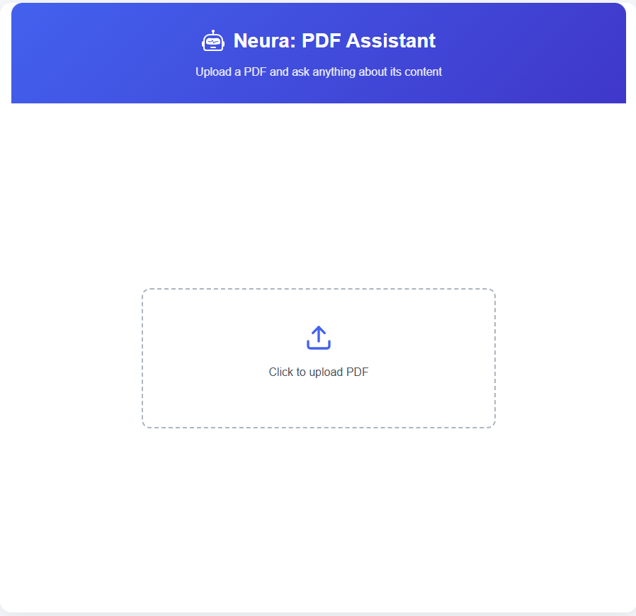

# 🧠 Neura: PDF Assistant

Neura PDF Assistant is an intelligent web tool that allows users to **upload PDF files and ask questions** based on the document content. Powered by **Gemini AI (Google Generative AI)**, it extracts information from PDFs and returns highly relevant, context-aware answers.

> 🔗 Live Demo: [https://neura-pdfassistant.haidersajjad.site](https://neura-pdfassistant.haidersajjad.site)  
> ⚙️ Backend API: [https://haidersajjad-pdf-assistant-backend.hf.space](https://haidersajjad-pdf-assistant-backend.hf.space)

---

## 🚀 Features

- 📄 Upload any PDF file
- ❓ Ask natural language questions
- 🤖 Answers generated using Google Gemini (Gemini 1.5 Flash)
- 🧠 Embedding + semantic search using Sentence Transformers + FAISS
- 🔁 Real-time response via connected backend
- 🌐 Fully deployed:
  - Frontend: **React on Vercel**
  - Backend: **Flask API on Hugging Face Spaces**

---

## 🛠 Tech Stack

- **Frontend:** React + Vercel
- **Backend:** Python + Flask + Hugging Face Spaces
- **AI Model:** `gemini-1.5-flash` via `google.generativeai`
- **Embeddings:** SentenceTransformer (`all-MiniLM-L6-v2`)
- **Similarity Search:** FAISS
- **PDF Parsing:** PyPDF2
- **Environment Handling:** `python-dotenv`
- **CORS:** flask-cors

---

## 📸 Preview



## 🧪 How It Works

1. **Upload PDF**
2. Text is extracted and split into chunks
3. Chunks are embedded using SentenceTransformer
4. FAISS builds a searchable vector index
5. User asks a question → most relevant chunks are retrieved
6. Context is sent to Gemini AI → response is returned to user

---

## 📂 Project Structure

```
neura: pdf assistant/
├── backend/			# Back-end created by using python deployed on Hugging face
│   ├── app.py                # Flask backend API
│   ├── requirements.txt      # Python dependencies
│   ├── space.yaml            # Hugging Face Spaces config
│   ├── .env                  # API key (not included in repo)
│   ├── Dockerfile
│   ├── test.pdf		# Text based pdf file for testing
│   └── static/               # Optional frontend root file (for HF serving)
└── frontend/			# Frontend created by using react deployed on vercel

````

---

## 📦 Installation (Local Testing)

```bash
git clone https://github.com/your-username/neura-pdf-assistant.git
cd neura-pdf-assistant

# Install dependencies
pip install -r requirements.txt

# Add your API key
echo "GOOGLE_API_KEY=your_api_key_here" > .env

# Run the app
python app.py
````

App will be available at `http://localhost:7860`

---

## 🌍 Deployment

### ✅ Backend on Hugging Face

* Uses `space.yaml` and `Dockerfile` to deploy Flask API
* Access the live backend at:
  `https://haidersajjad-pdf-assistant-backend.hf.space`

### ✅ Frontend on Vercel

* Deployed separately with CORS enabled
* Uses: `https://neura-pdfassistant.haidersajjad.site`
* Communicates with Hugging Face backend

---

## 🔐 Environment Variables

Create a `.env` file with:

```
GOOGLE_API_KEY=your_gemini_api_key
```

This is automatically loaded using `python-dotenv`.

---

## 🧠 About the Name: Neura

“**Neura**” is a future-focused brand name for a series of intelligent assistants. This PDF assistant is just the beginning — more tools like `Neura Chat`, `Neura Resume`, and `Neura Code` are planned.

---

## 📬 Contact

Made by [Haider Sajjad](https://haidersajjad.site)
🔗 Portfolio: [haidersajjad.site](https://haidersajjad.site)

---

## 📜 License

This project is open-source under the [MIT License](LICENSE).

```